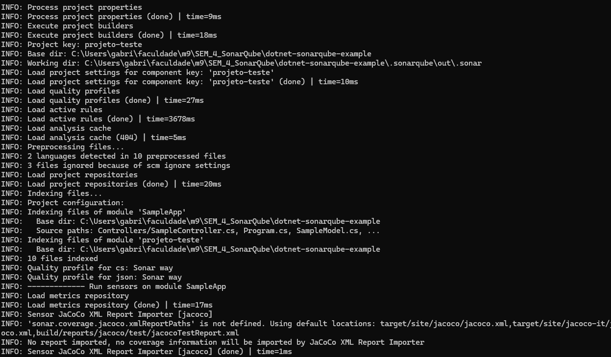
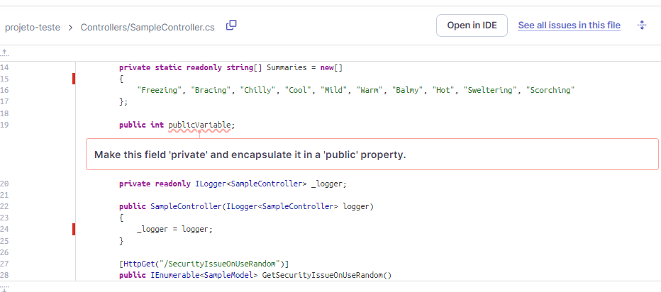
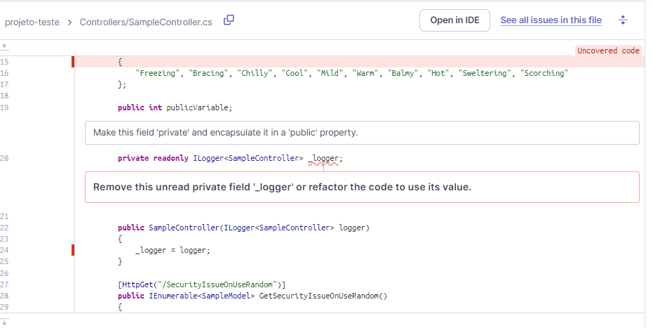
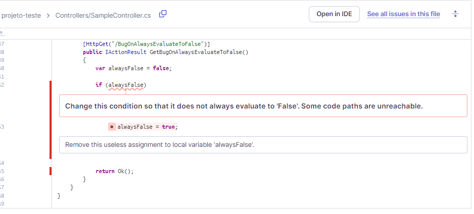
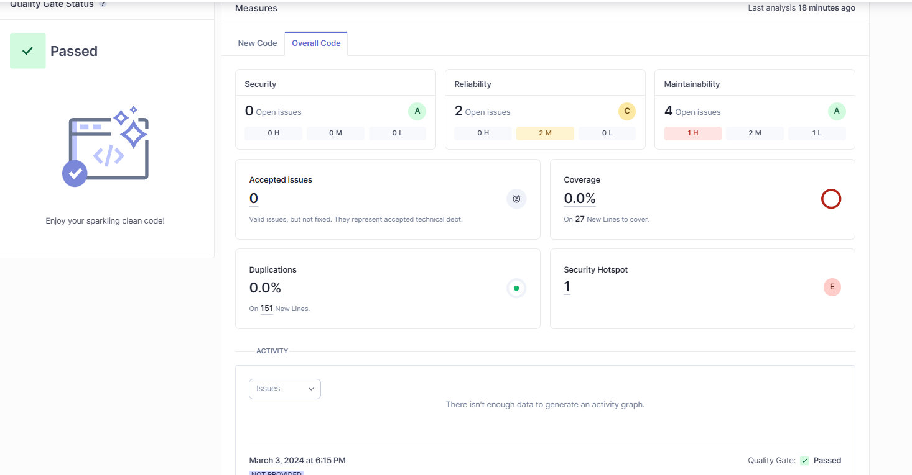

# Análise de código estático com SonarQube

O Sonar Qube é uma ferramenta muito importante, que básicamente faz a análise estática do código, ou seja, ele verifica o código fonte e identifica possíveis problemas, como bugs, vulnerabilidades, códigos duplicados, entre outros.

# Preparação da análise

Primeiro, clonei o repositório indicado no artigo, instalei o Java na sua última versão, e rodei o SonarQube no Docker.

# Execução 

Os comandos abaixo foram executados no terminal, para que a análise fosse realizada.

```sh
dotnet sonarscanner begin /k:"project-key" /d:sonar.login=admin /d:sonar.password=admin
dotnet build <path_to_solution.sln>
dotnet sonarscanner end /d:sonar.login=admin /d:sonar.password=admin
```

## Logs da análise



## Exemplos de issues encontradas







## Overview



# Conclusão
A partir dessa atividade, podemos dizer que a análise estática de código é uma ferramenta muito importante para a identificação de problemas no código, e que o SonarQube é uma ferramenta muito poderosa para isso.